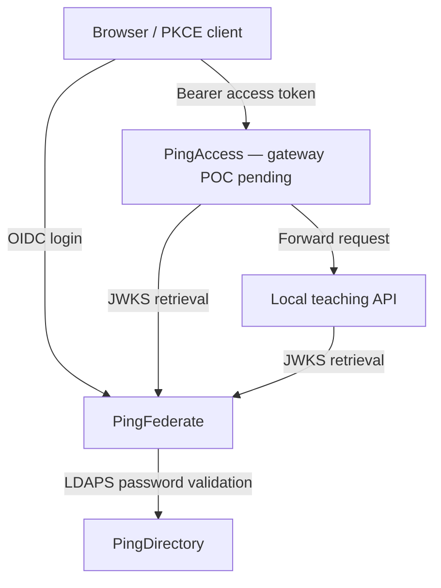

# Dhone IAM Lab

Practical Ping Identity proof of concepts using PingFederate, PingDirectory and PingAccess. PingOne, DaVinci and authenticator-app MFA are planned next. The learning goal is to build, explain, test and troubleshoot an identity flow, including its rejection paths.

This is a personal learning project associated with **dhone.in**. It contains original lab notes, PowerShell helpers and configuration examples. It is not an official Ping Identity distribution or a production deployment kit.

**Snapshot: 1 October 2026.** Results below distinguish observed command output from user-reported success and unfinished work.

## Cost and prerequisites

Publishing this source and documentation in a normal public repository is supported by [GitHub Free](https://docs.github.com/en/get-started/learning-about-github/githubs-plans). This package enables no paid services, GitHub Actions workflows, Codespaces, Git LFS or Packages uploads. GitHub stores the project; the IAM products continue running on your own lab computer.

You need your own authorized Ping product licenses, images, Windows lab machine, Docker Desktop Linux engine and public certificates from your own deployment. NFR credentials, product binaries, private keys, backups, secrets and running tunnel addresses are not distributed here. PingOne/DaVinci cloud entitlement must be checked separately before those exercises.

## What works today

| POC | Evidence and status |
|---|---|
| PingDirectory foundation | Verified: 12 identity OUs plus `groups` and `services`; fictional employee and group membership |
| LDAP permissions | Verified: service reads, tested writes denied, anonymous probe returned no entries |
| Employee OIDC + PKCE | Verified: authorization code flow, S256, state, nonce, RS256 ID-token signature, issuer, audience and lifetime |
| Direct protected API | Verified: 401 for missing/wrong/tampered tokens; 200 with `lab.read`; 403 without it |
| Directory recovery | Verified: isolated `userRoot` restore and recovered-entry checks; not a full-system recovery |
| PingAccess installation and TLS | Verified: healthy container, console login, license accepted, admin/engine certificate validation |
| PingAccess gateway enforcement | **Pending:** valid tokens previously received 401 because actual JWKS retrieval returned HTML/HTTP 400 |
| Public OIDC discovery | Verified through a free ngrok endpoint; live address omitted |
| New WebApp onboarding | User reported success after ATM eligibility guidance; token validation details not supplied |
| Employee authenticator MFA | **Planned:** cloud MFA entitlement and environment details needed |
| PingOne / DaVinci | **Planned:** no completed cloud POC claimed |

## Architecture



The direct API exercise also calls the loopback API without the gateway. This is deliberate during development; preventing direct backend access is a separate pending POC.

## Start here

1. Read [lab setup and assumptions](docs/setup.md). The original PingFederate runtime persistence still needs full recovery validation, so this repository does not recreate an existing PF container.
2. Build the [directory foundation](docs/directory.md).
3. Configure [employee OIDC and PKCE](docs/pingfederate-oidc.md).
4. Run [the validation exercises](docs/validation.md).
5. Continue with [PingAccess](docs/pingaccess.md), [public discovery](docs/public-discovery.md), and the [use-case roadmap](docs/use-cases.md).

On an already configured Windows lab:

```powershell
powershell.exe -NoProfile -ExecutionPolicy RemoteSigned -File .\scripts\Dhone-Lab.ps1 Status
powershell.exe -NoProfile -ExecutionPolicy RemoteSigned -File .\scripts\Dhone-Lab.ps1 Start -WithApi
powershell.exe -NoProfile -ExecutionPolicy RemoteSigned -File .\scripts\Dhone-PKCE-Test.ps1 -Scope 'openid lab.read' -TestApi
powershell.exe -NoProfile -ExecutionPolicy RemoteSigned -File .\scripts\Dhone-PKCE-Test.ps1 -Scope 'openid' -TestApi
```

The helpers use existing containers named `pingdirectory`, `pingfederate`, and optionally `pingaccess`, in the local `desktop-linux` Docker context. Certificate defaults point to `$env:USERPROFILE\DhoneLab\certs`. Review a script before running it, especially the installer, trust-store helper and recovery test.

## Repository contents

- `scripts/`: eight lab helpers; keep the lifecycle controller and teaching API together.
- `examples/`: fictional directory entries, a PD Compose example and an ngrok runtime policy template.
- `docs/`: configuration steps, tested outcomes, troubleshooting, recovery and planned POCs.
- [.gitignore](.gitignore): excludes local secrets, certificates, runtime data, backups and logs.
- [Publication notes](docs/publication.md): scope and validation limits of this snapshot.

The PowerShell OIDC client and API are teaching implementations, not production security libraries. See [security and data handling](SECURITY.md) before contributing evidence.
